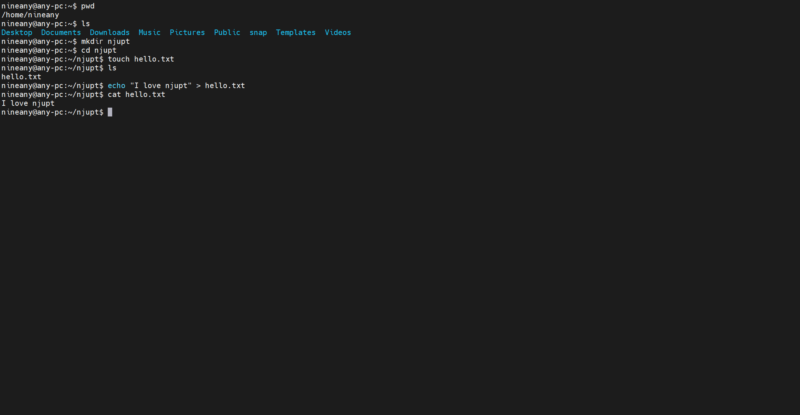

## 前言
使用的版本是Ubuntu22.04，目前只在连接虚拟机尝试成功过，如有问题欢迎指正
## 前置条件
1. 安装好MobaXterm[官网下载](https://mobaxterm.mobatek.net/)
2. 在Ubuntu中**安装好ssh服务**
    ```shell
    sudo apt install openssh-server
    ```
3. 通过`hostname -I`可以获取到自己的ip地址(这里不用ipconfig下载额外的工具)
## 开始连接
1. 打开MobaXterm的左上角的Session
2. 选择**SSH**连接
3. 在`Remote host`上填写你上面获得的ip地址
4. 在`Specify username`勾选，然后写上你Ubuntu的用户名
5. 点击OK，输入密码就可以成功连接了

>这里端口默认就行，除非被占用
## 作业任务输入
